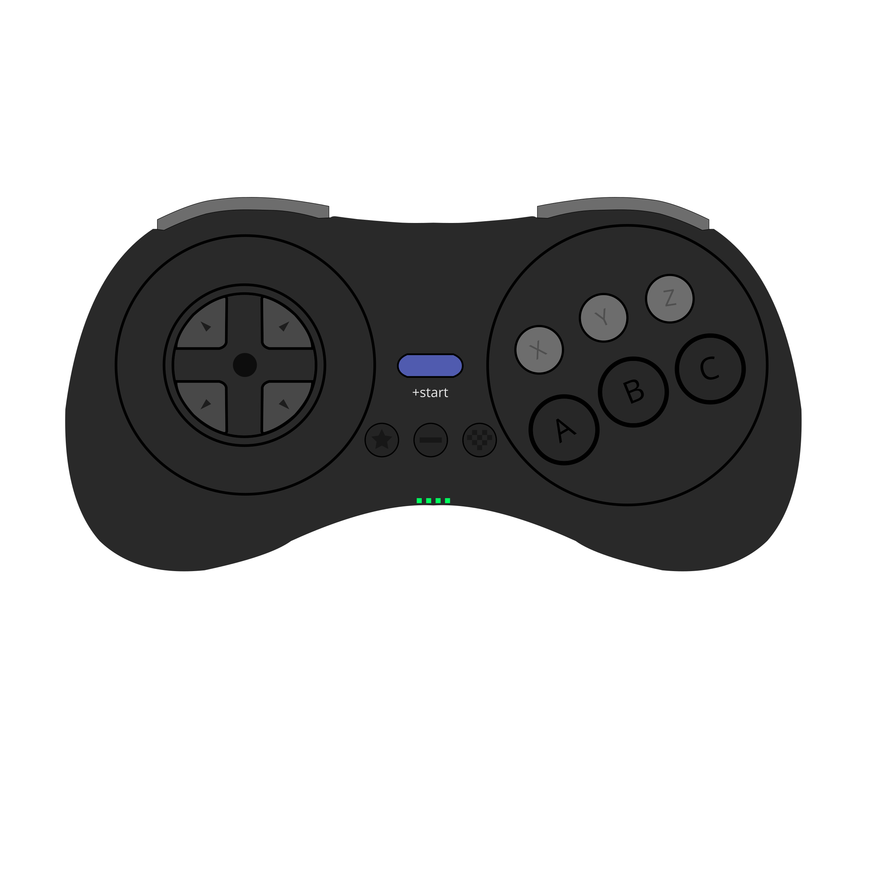

# Gamepad-Viewer Sega Controller

Un joystick de sega para mostrar interacciones en tiempo real
 

# Cómo usar #
Todo lo que debes hacer es abrir el link de *Gamepad Viewer* en tu explorador cuando tu joystick esté conectado. Ahora podés incluir la ventana del explorador en OBS para mostrar tus interacciones en tiempo real.

Link al controlador:  
https://gamepadviewer.com/?p=1&s=5&editcss=https%3A%2F%2Fschoettner.github.io%2Fedit.css

Tenés que usar [Github.io](github.io) para publicar tu imagen y archivos css. Raw git o gist ya no funciona para todas las cuentas de git.

# Referencias #
[Gamepad Viewer](https://gamepadviewer.com/)  
[Example Style Sheet](https://gist.github.com/mrmcpowned/a787fc4f5307b7c008fb#file-edit-example-css)  
[Example Edit css](https://gist.github.com/mrmcpowned/2d4d29bd186c75b35c4da3f410f8690f)  
[Default css](https://gamepadviewer.com/style.css)  